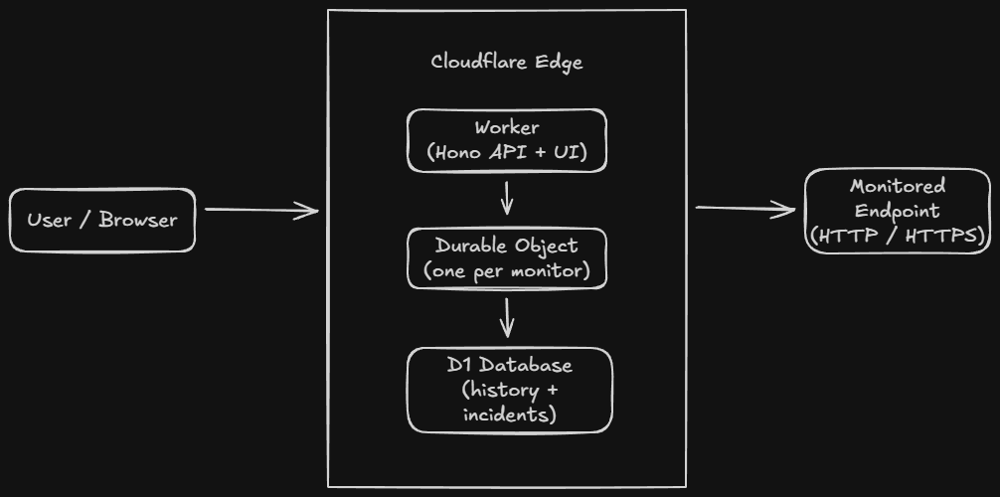

<p align="center">
   
</p>

<h1 align="center">Vigil</h1>

<p align="center">
   Uptime monitoring that runs on your Cloudflare account. One repo, one deploy, monitoring from the edge in minutes.
</p>

---

[](https://deploy.workers.cloudflare.com/?url=https://github.com/gmmurray/vigil)

## Overview

Vigil is a self-hosted uptime monitoring tool that runs on Cloudflare Workers. It uses Durable Objects for per-monitor scheduling, D1 for persistence, and deploys with a single command. It is built for personal use and shared openly for public benefit.

**Scope:** Designed for 10-100 endpoints: personal projects, small teams, or a handful of client sites. Not built for enterprise multi-tenancy or complex integrations.

**Platform:** Cloudflare-native. Workers, Durable Objects, and D1 run on the same edge nodes and communicate through bindings. No containers, no orchestration, no internal API keys.

**Expectations:** Vigil is a personal project shared as open source. It runs entirely inside your Cloudflare account. Availability, alert delivery, and data retention depend on your Cloudflare configuration and limits. No SLA, no redundancy across providers, no external watchdog. If Cloudflare has an outage, so does your monitoring.

## Tech Stack

| Layer              | Technologies                                           |
| ------------------ | ------------------------------------------------------ |
| Runtime            | Cloudflare Workers, Durable Objects, D1 (SQLite)       |
| Backend            | Hono, Drizzle ORM                                      |
| Frontend           | React, Vite, TailwindCSS, React Router, TanStack Query |
| Forms & Validation | React Hook Form, Zod                                   |
| Charts             | Recharts                                               |
| Dev Tooling        | TypeScript, Biome, Vitest, Wrangler                    |

## Features

- **HTTP endpoint monitoring** with configurable methods, headers, expected status codes, and timeouts
- **Smart status detection**: UP, DEGRADED, DOWN, RECOVERING states with consecutive failure thresholds
- **Automatic incident tracking**: incidents open when services go down and close on recovery
- **Notifications via webhooks** with retry logic and exponential backoff—failed deliveries are logged but not retried indefinitely (notification system is extensible to other channels)
- **Real-time dashboard** with response time charts and check history
- **Data retention controls**: automatic cleanup of old check results
- **Test before you commit**: validate endpoints and notification channels before enabling

## Quick Start

### Deploy with the Button

1. Click the **Deploy to Cloudflare** button above
2. Authenticate with your Cloudflare account
3. Configure your deployment:
   - **Project name** — defaults to `vigil`, determines your Worker URL
   - **D1 database** — create a new one or select an existing database
   - **CHECK_RESULTS_RETENTION_DAYS** — how long to keep check history (default: 15)
4. Once deployed, your instance will be available at `<project-name>.<your-subdomain>.workers.dev`

The deploy process automatically updates `wrangler.jsonc` in your forked repo with your project name and database configuration.

## Securing Your Instance

Vigil has no in-app authentication. It's designed to sit behind [Cloudflare Access](https://www.cloudflare.com/zero-trust/products/access/), which handles auth at the network layer before requests ever reach your application. You get SSO, MFA, and device posture checks without adding auth complexity to the application itself.

### Setting Up Cloudflare Access

1. **Navigate to Zero Trust**
   In the Cloudflare dashboard, go to **Zero Trust** → **Access Controls** → **Applications**

2. **Add an Application**
   - Click **Add an application** → **Self-hosted**
   - Name it something like "Vigil"
   - Set the **Application domain** to your Worker's URL (e.g., `vigil.your-subdomain.workers.dev`)

3. **Configure a Policy**
   - Create a policy name (e.g., "Allow me") **Policies** → **Add a policy**
   - Under **Add rules** → **Include**, add a rule:
     - For personal use: **Emails** → your email address
   - Save the policy

4. **Save and Test**
   Save your application, then visit your Vigil URL—you should be prompted to authenticate before seeing the dashboard.

If your use case differs from the above instructions, visit the [Cloudflare Docs](https://developers.cloudflare.com/cloudflare-one/).

Once Access is configured, only authenticated users can reach your Vigil instance. The application itself doesn't need to know or care about who's logged in.

## Architecture



**How it works:**

- **Each monitor gets its own Durable Object.** This provides natural isolation: one misbehaving endpoint can't affect others. The DO manages its own check schedule using Alarms. Checks execute from Cloudflare's edge location hosting the DO instance; Vigil does not fan out checks to multiple regions per endpoint.

- **Checks run on a configurable interval** (default: 60 seconds). The Durable Object wakes up, performs the HTTP check, records the result, and goes back to sleep.

- **State transitions are deterministic.** A monitor doesn't flip to DOWN on a single failure. It requires consecutive failures (default: 3) to avoid false positives from transient network issues.

- **All data lives in D1.** Check results, incidents, and notification logs all persist in a SQLite database at the edge.

- **A daily cron job cleans up old data.** Check results older than the retention period (default: 15 days) are automatically pruned.

- **No internal API keys.** All communication between Workers, Durable Objects, and D1 uses Cloudflare bindings. The only outbound HTTP calls are the health checks themselves.

## Configuration

Configuration is handled through environment variables in `wrangler.jsonc`:

| Variable                       | Default | Description                                          |
| ------------------------------ | ------- | ---------------------------------------------------- |
| `CHECK_RESULTS_RETENTION_DAYS` | `15`    | How long to keep check result history before cleanup |

Per-monitor settings are configured in the UI:

| Setting               | Default | Description                                |
| --------------------- | ------- | ------------------------------------------ |
| Check interval        | 60s     | How often to check the endpoint            |
| Request timeout       | 5s      | How long to wait for a response            |
| Expected status codes | 200     | Comma-separated list (e.g., `200,201,204`) |
| Consecutive failures  | 3       | Failures required before marking DOWN      |

Lower check intervals and longer retention increase Durable Object wakeups and D1 storage, which may affect Cloudflare billing.

## Local Development

### Prerequisites

- Node.js 20+
- pnpm (`corepack enable` if you have Node 20+)
- A Cloudflare account (for Wrangler authentication)

### Setup

```bash
# Clone the repository
git clone https://github.com/gmmurray/vigil.git
cd vigil

# Install dependencies
pnpm install

# Create a local D1 database and run migrations
pnpm migrate:local

# Start the development server
pnpm dev
```

The dev server runs at `http://localhost:5173` with hot reload for the frontend. The Worker runs locally via Wrangler's development mode.

### Running Tests

```bash
# Unit tests (watch mode)
pnpm test

# Unit tests (single run)
pnpm test:run
```

### Code Quality

```bash
# Lint and format
pnpm check
```

## Manual Deployment

If you prefer deploying manually over the button:

```bash
# 1. Clone and install
git clone https://github.com/gmmurray/vigil.git
cd vigil
pnpm install

# 2. Create a D1 database (use any name you prefer)
wrangler d1 create vigil-db

# 3. Update wrangler.jsonc with your project name, database_id, and database_name
#    (the create command outputs the database_id)
#
# 4. Build and deploy
pnpm deploy
```

The `pnpm deploy` command runs database migrations and deploys the Worker in one step.

> _If you prefer not to store your `database_id` in version control, you can set `D1_DATABASE_ID` in the Cloudflare Worker dashboard under **Settings** → **Build** → **Variables and secrets**. Make sure to set it here, not under the runtime **Variables and Secrets** configuration. A build script `scripts/set-db-id.js` will set the value in `wrangler.jsonc` to the value of `D1_DATABASE_ID`._

### Updating an Existing Deployment

```bash
git pull
pnpm deploy
```

Migrations are applied automatically before each deploy.

## License

MIT
